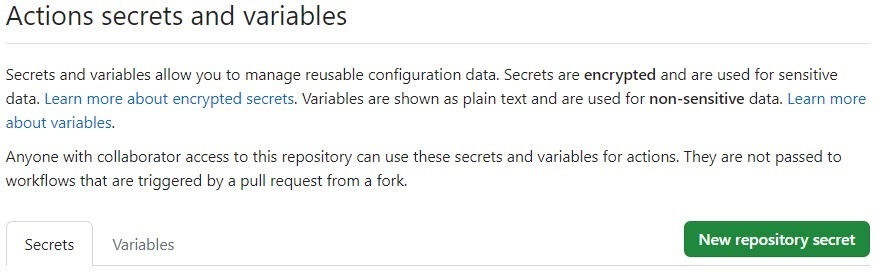
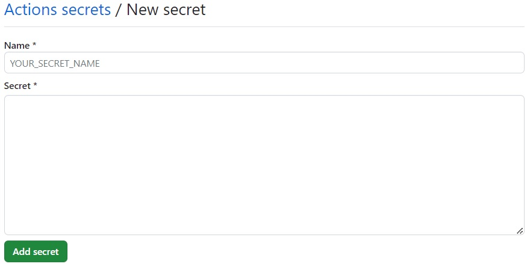

# Environments

## 新規作成
github の project の settings > Environments を選択し、`New Environment`ボタンを押下

| |
|:--|
 

作成するEnvironment名を入力

| |
|:--|
 

## secret と variable の登録
actionからは `${{ secrets.<シークレット名> }}` で参照することができる  

| |
|:--|
 
