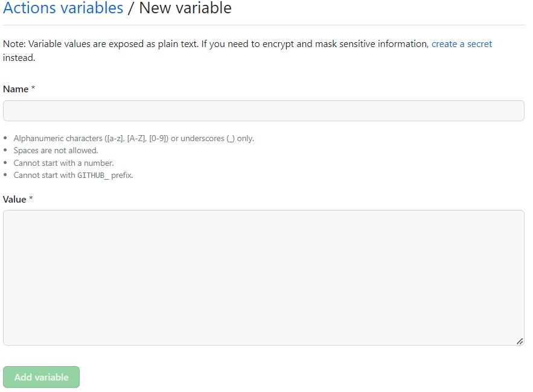

# variables

variableは`Organization variables` と `repository secret` と `environment secret` の3種類ある  

|  名称  |  スコープ  |  用途  |
| ---- | ---- | ---- |
|  Organization variables  |  Organization内の全レポジトリの全ワークフローから参照可能  |  Organization全体で利用する値  |
|  Repository variables  |  レポジトリ内の全てのワークフローから参照可能  |  レポジトリ全体で利用する値  |
|  Environments variables  |  レポジトリ内の全てのワークフローが特定環境用に実行される際に参照可能  |  レポジトリで定義した環境によって値を変える  |

## 登録 (repository variables)
github の project の settings > Secrets and variables > Actions > New repository variable ボタン

| |
|:--|
<br/>

| |
|:--|
<br/>

## 登録 (organization variables)
organizationの Settings > Security > Secrets and variables > Actions を開き、  
New organization variable ボタンから  
<br/>

## 参照
actionからは `${{ vars.<変数名> }}` で参照することができる  

例：
```
jobs:
  get-variable:
    runs-on: ubuntu-latest
    steps:
      - name: Get variable
        run: |
          echo ${{ vars.myvar }}
```
